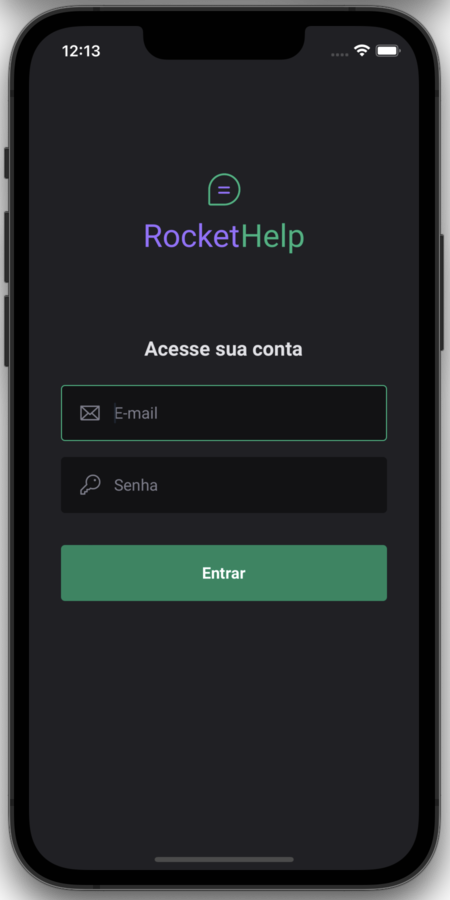
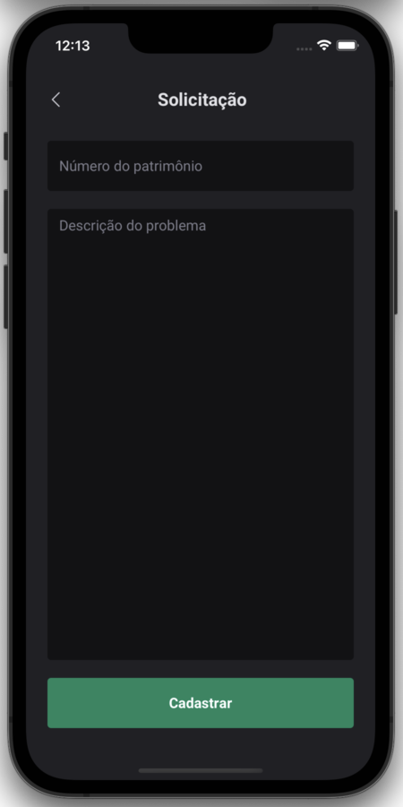

## Rocket Help

A React Native app created during Rocketseat Ignite Lab.

## Table of contents

- [Table of contents](#table-of-contents)
- [About the project](#about-the-project)
- [Screenshots](#screenshots)
- [Installation](#installation)
- [Technologies used](#technologies-used)

## About the project

RocketHelp is an Android and iOS app that works as a company service management, where users can create calls and attach solutions to equipment problems.

The app was built with React Native using Expo Bare Workflow and has integration with Google Firebase.

## Screenshots

   
   
   
   
   

## Installation

1. Clone down this repository. You will need `node` and `expo` installed globally on your machine.

   `git clone https://github.com/MarceloDJunior/rocket-help.git`

2. Install dependencies:

   `yarn` or `npm install`

3. Start Expo Server:

   `expo start`

4. See the instructions in terminal to open the app.

## Technologies used

- [React Native](https://reactnative.dev)
- [Expo Bare Workflow](https://expo.dev)
- [TypeScript](https://www.typescriptlang.org)
- [Native Base](https://nativebase.io)
- [Firebase Auth](https://firebase.google.com/docs/auth?hl=pt-br)
- [Firebase Cloud Firestore](https://firebase.google.com/docs/firestore)
- [Phosphor Icons](https://phosphoricons.com)
- [React Navigation](https://reactnavigation.org)
